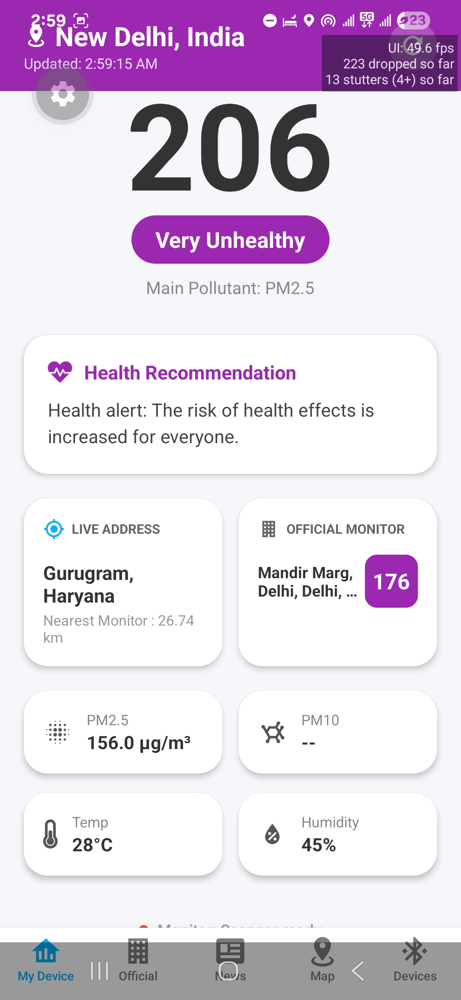

<div align="center">

# 🌫️ AQI Intelligence
### AI-Driven Urban Air Pollution Intelligence Platform

**Hyperlocal · Real-time · Community-powered · AI-guided**

[](#)
[](#)
[](#)
[](#)
[](#)

</div>

---

## 📖 Table of Contents

1. [The Problem](#-the-problem)
2. [Our Vision & Solution](#-our-vision--solution)
3. [System Architecture Overview](#-system-architecture-overview)
4. [Core Platform Components](#-core-platform-components)
   - [Mobile App (React Native)](#1-the-universal-aqi-mobile-app)
   - [Data Pipeline (Python)](#2-data-pipeline--backend-sync)
   - [Cloud Database (Supabase)](#3-cloud-database-supabase)
   - [RAG-Based AI Assistant](#4-rag-based-ai-assistant)
   - [Community Gamification](#5-community-driven-gamification)
5. [Tech Stack](#-tech-stack)
6. [Project Structure](#-project-structure)
7. [Database Schema](#-database-schema)
8. [Getting Started](#-getting-started)
9. [Environment Variables](#-environment-variables)
10. [How We Compare](#-how-we-compare)
11. [Screenshots](#-screenshots)
12. [Contributing](#-contributing)
13. [Roadmap](#-roadmap)

---

## 🚨 The Problem

Delhi NCR is one of the world's most polluted urban environments, yet our monitoring infrastructure is dangerously thin:

| Issue | Current Reality |
|---|---|
| **Station Coverage** | ~46 CPCB stations across Delhi NCR — one per ~60 km² |
| **Spatial Resolution** | Each station covers only ~1–1.5 km radius |
| **Update Frequency** | Government dashboards are often hours behind |
| **Personal Context** | No system accounts for *your* location, health profile, or activity |
| **Data Silos** | Environmental, weather, hospital, and news data exist in completely separate silos |
| **Actionability** | Raw AQI numbers give no personalized guidance |

The result: millions of people in Delhi NCR are making health decisions based on incomplete, decontextualized, and stale air quality data.

---

## 💡 Our Vision & Solution

AQI Intelligence is building a **hybrid, multi-source, AI-guided air quality platform** that addresses all of these gaps simultaneously.

**Our core thesis:** The combination of crowdsourced sensing + official monitoring + contextual data (weather, health, news) + AI reasoning produces public health guidance that is orders of magnitude more useful than any single data source alone.

**Three parallel tracks:**
1. **Higher Resolution** — Crowdsourced personal sensor data dramatically increases spatial coverage
2. **Richer Context** — 13+ data sources fused together for a complete picture
3. **Actionable AI** — RAG-based assistant translates data into personalized, plain-language health guidance

---

## 🏗️ System Architecture Overview

```
┌─────────────────────────────────────────────────────────────────┐
│                      USER LAYER                                  │
│   Mobile App (Android/iOS)  ·  Web Dashboard  ·  Notifications  │
└──────────────────────────┬──────────────────────────────────────┘
                           │
┌──────────────────────────▼──────────────────────────────────────┐
│                   APPLICATION LAYER                              │
│  Device Adapter Layer · AQI Logic · Location Service            │
│  News Service · Government AQI Service · OpenAQ Service         │
└───────────┬──────────────────────────────────┬──────────────────┘
            │                                  │
┌───────────▼──────────┐         ┌─────────────▼─────────────────┐
│  LOCAL STORAGE        │         │   CLOUD (Supabase)             │
│  SQLite (expo-sqlite) │◄───────►│   PostgreSQL + pgvector        │
│  • Offline cache      │   sync  │   • government_stations        │
│  • User readings      │         │   • readings                   │
│  • News articles      │         │   • news_articles              │
└───────────────────────┘         │   • historical_measurements    │
                                  └─────────────────┬─────────────┘
                                                    │
                                  ┌─────────────────▼─────────────┐
                                  │   DATA PIPELINE (Python)       │
                                  │   OpenAQ v3 API → Supabase    │
                                  │   Runs every 10 minutes        │
                                  └───────────────────────────────┘
```

---

## 🔧 Core Platform Components

### 1. The Universal AQI Mobile App

Built with **React Native + Expo Router**, the app is the primary interface for users and data contributors. It runs natively on **Android and iOS**, and as a **Progressive Web App** in the browser.

#### App Screens

| Screen | Description |
|---|---|
| **Dashboard (`index`)** | Live AQI overview, nearest official station, personal readings, 24-hour trend chart |
| **Official Monitors (`stations`)** | Categorized list of all Delhi NCR monitoring stations from the Supabase cloud cache, sorted by AQI |
| **Map (`map`)** | Interactive Leaflet map (web) / React Native Maps (native) with station markers and real-time AQI overlays |
| **News (`news`)** | Curated environmental news feed from NewsData.io, stored locally and in Supabase |
| **Devices (`devices`)** | Manage connected personal AQI sensors (Bluetooth BLE) |

#### Device Adapter Layer

A key architectural innovation is the **modular Device Adapter Layer**. Since no universal protocol exists for personal AQI monitors, we built a plugin-style abstraction that supports:

```
DeviceAdapter (interface)
  ├── BluetoothAdapter    → BLE devices (ESP32, Arduino-based monitors)
  ├── CloudApiAdapter     → Devices that push to a proprietary cloud API
  ├── WifiDirectAdapter   → Local Wi-Fi devices on same network (planned)
  └── ManualEntryAdapter  → Manual user input with GPS tagging (planned)
```

This pattern means any new sensor hardware can be integrated by implementing a single interface — no app rewrite required.

#### Key Services (TypeScript)

| Service | Role |
|---|---|
| `SupabaseService.ts` | Full CRUD against Supabase cloud DB (stations, readings, news, historical data) |
| `LocalStorageService.ts` | SQLite-backed offline storage — mirrors Supabase API for seamless fallback |
| `GovernmentAqiService.ts` | Fetches live data from the 112-station Delhi NCR cache |
| `OpenAqHistoricalService.ts` | Fetches historical sensor measurements from OpenAQ v3 |
| `NewsService.ts` | Fetches & caches environmental news from NewsData.io |
| `LocationService.ts` | GPS location + reverse geocoding for nearest-station detection |

---

### 2. Data Pipeline & Backend Sync

The Python pipeline (`data_pipeline/pipeline.py`) is a standalone, continuously-running process that acts as the backbone of real-time data availability.

#### What It Does

```
Every 10 minutes:
 1. Fetches all monitoring station metadata for Delhi NCR bbox
    (28.3°N–28.9°N, 76.8°E–77.5°E) from OpenAQ v3 API
 2. For each station, calls /locations/{id}/latest to get fresh readings
 3. Maps raw sensor IDs → pollutant names (PM2.5, PM10, O3, NO2, SO2, CO)
 4. Calculates US EPA AQI score from PM2.5 using the standard breakpoint formula
 5. Batch-upserts station data → Supabase `government_stations` table
 6. Appends timestamped readings → Supabase `readings` table for historical analysis
```

#### AQI Calculation

The pipeline implements the full **US EPA AQI breakpoint formula** for PM2.5 (0–500 scale):

```python
# Example breakpoints:
PM2.5  0.0 – 12.0   →  AQI   0 – 50   (Good)
PM2.5 12.1 – 35.4   →  AQI  51 – 100  (Moderate)
PM2.5 35.5 – 55.4   →  AQI 101 – 150  (Unhealthy for Sensitive Groups)
PM2.5 55.5 – 150.4  →  AQI 151 – 200  (Unhealthy)
PM2.5 150.5 – 250.4 →  AQI 201 – 300  (Very Unhealthy)
PM2.5 250.5+        →  AQI 301 – 500  (Hazardous)
```

#### Technical Highlights

- **Python 3.8+ compatible** — Uses only `requests` + `python-dotenv` (no Supabase SDK dependency conflicts)
- **Direct REST upserts** — Bypasses the Supabase Python SDK by calling the PostgREST API directly
- **Rate limit handling** — Automatic exponential backoff on OpenAQ 429 responses
- **Batch processing** — 100-row batches to stay within Supabase request limits
- **Secure writes** — Every DB write includes a server-validated `app_secret` token to prevent unauthorized writes from anonymous clients

#### Running the Pipeline

```bash
cd data_pipeline
pip install -r requirements.txt
cp .env.example .env   # Add your keys
python pipeline.py
```

---

### 3. Cloud Database (Supabase)

All persistent data is stored in **Supabase** (PostgreSQL-as-a-service, hosted in `ap-northeast-2`).

#### Tables

| Table | Primary Key | Description |
|---|---|---|
| `government_stations` | `uid` | All OpenAQ/WAQI monitoring stations with latest AQI and pollutant values |
| `readings` | `id` (UUID) | Time-series AQI readings from personal sensors and the pipeline |
| `news_articles` | `id` | Environmental news from NewsData.io with full article content |
| `historical_measurements` | `(sensor_id, measured_at, parameter)` | Granular historical sensor data for trend analysis |

#### Security Model

- **Row-Level Security (RLS)** enabled on all tables
- Writes validated via `app_secret` token (server-side PostgreSQL function `valid_app_secret()`)
- Anonymous clients can **read** all public data; **writes** require the secret token
- The Supabase anonymous key is safe to include in the mobile app (read-only by design)

---

### 4. RAG-Based AI Assistant

We are building a **Retrieval-Augmented Generation (RAG)** system that synthesizes **13+ heterogeneous data sources** to generate highly personalized, context-aware air quality guidance.

#### Why RAG (Not a Trained Model)?

| Approach | Our Choice | Reason |
|---|---|---|
| Train LLM from scratch | ❌ | Requires billions of tokens + $100K+ compute |
| Fine-tune existing LLM | 🟡 Future | Useful for domain vocabulary, not for live data |
| **RAG (Retrieval-Augmented)** | ✅ **Now** | Live data injected at query time; always fresh; cheap |

<!-- #### The 13+ Data Sources

| # | Source | Type | Frequency |
|---|---|---|---|
| 1 | AQI Station Readings | Structured | Every 10 minutes ✅ |
| 2 | Pollutant Breakdown (PM2.5, PM10, O3, NO2, SO2, CO) | Structured | Every 10 min ✅ |
| 3 | Satellite AOD (Aerosol Optical Depth) | Raster | Daily |
| 4 | Weather Conditions | Structured | Hourly |
| 5 | Wind Speed & Direction | Structured | Hourly |
| 6 | Humidity & Temperature | Structured | Hourly |
| 7 | Hospital / Emergency Admissions | Semi-structured | Daily |
| 8 | Population Density | GeoJSON | Static (yearly) |
| 9 | Vulnerable Group Mapping | GeoJSON | Static |
| 10 | In-App User Surveys / Crowdsourced Reports | Unstructured | Real-time |
| 11 | Social Media Sentiment | Unstructured | Real-time |
| 12 | Urban Infrastructure (OSM) | GeoJSON | Static |
| 13 | Traffic Density | Structured | Real-time |
| 14 | Environmental News | Unstructured | Hourly ✅ | -->

#### Full RAG System Architecture

```
┌─────────────────────────────────────────────────────────────┐
│                     DATA INGESTION LAYER                    │
├──────────────┬──────────────┬──────────────┬────────────────┤
│  Real-time   │   Hourly     │    Daily     │    Static      │
│  Collectors  │  Collectors  │  Collectors  │   Loaders      │
│              │              │              │                │
│ • OpenAQ     │ • Weather    │ • News       │ • Population   │
│ • User input │ • Traffic    │ • NASA sat.  │ • OSM infra.   │
│ • Surveys    │ • Sentiment  │ • Hospital   │ • Census data  │
└──────┬───────┴──────┬───────┴──────┬───────┴───────┬────────┘
       │              │              │               │
       ▼              ▼              ▼               ▼
┌─────────────────────────────────────────────────────────────┐
│                   PROCESSING LAYER                          │
│                                                             │
│  ┌─────────────────┐    ┌───────────────────────────────┐   │
│  │ Structured Data │    │    Unstructured Data          │   │
│  │ Processor       │    │    Processor                  │   │
│  │                 │    │                               │   │
│  │ • Normalize AQI │    │ • Chunk news articles (512t)  │   │
│  │ • Geo-tag data  │    │ • Extract survey insights     │   │
│  │ • Time-align    │    │ • Summarize hospital reports  │   │
│  └────────┬────────┘    └──────────────┬────────────────┘   │
└───────────┼──────────────────────────┼──────────────────────┘
            │                          │
            ▼                          ▼
┌────────────────────────────────────────────────────────────┐
│                    STORAGE LAYER (Supabase)                │
│                                                            │
│  ┌────────────────┐    ┌───────────────────────────────┐   │
│  │  PostgreSQL    │    │   pgvector (Vector Store)     │   │
│  │  (structured)  │    │                               │   │
│  │                │    │  • News embeddings            │   │
│  │  • AQI readings│    │  • Survey embeddings          │   │
│  │  • Weather logs│    │  • Hospital report embeddings │   │
│  │  • Station meta│    │  • Social sentiment vectors   │   │
│  │  • User data   │    │  • Infrastructure chunks      │   │
│  └────────────────┘    └───────────────────────────────┘   │
└────────────────────────────────────────────────────────────┘
            │                          │
            ▼                          ▼
┌─────────────────────────────────────────────────────────────┐
│                    RAG QUERY ENGINE                         │
│                                                             │
│  User Query + Location + Profile                            │
│       │                                                     │
│       ├─► Structured Retrieval ──► SQL queries to Postgres  │
│       │   (AQI, weather, traffic, hospital)                 │
│       │                                                     │
│       ├─► Semantic Retrieval ────► pgvector similarity      │
│       │   (news, surveys, reports, sentiment)               │
│       │                                                     │
│       └─► Geo-Spatial Filter ───► PostGIS radius queries    │
│           (only data near user's location)                  │
│                          │                                  │
│                          ▼                                  │
│              Context Assembly (structured prompt)           │
└─────────────────────────────────────────────────────────────┘
            │
            ▼
┌─────────────────────────────────────────────────────────────┐
│                    LLM LAYER                                │
│                                                             │
│  Gemini 1.5 Flash / Groq Llama 3.1                         │
│                                                             │
│  System: "You are AtmoPulse AI, an air quality health       │
│  advisor for Delhi NCR. Use ONLY the provided context..."   │
│                                                             │
│  Context: [AQI][Weather][News][Hospital][Surveys][Infra]    │
│                                                             │
│  Output: Structured JSON guidance                           │
└─────────────────────────────────────────────────────────────┘
            │
            ▼
┌─────────────────────────────────────────────────────────────┐
│                   RESPONSE LAYER (Mobile App)               │
│                                                             │
│  • Health risk score (1–10)                                 │
│  • Personalized activity guidance                           │
│  • Nearest safe zone recommendation                         │
│  • Trend prediction (next 6 hours)                          │
│  • Alert severity level                                     │
└─────────────────────────────────────────────────────────────┘
```

#### Example AI Query & Response

```
User: "Is it safe to go jogging at India Gate at 7 AM tomorrow?"

Context injected by RAG:
  AQI @ CP Station: 187 (Unhealthy) | PM2.5: 89µg/m³
  Wind: 8 km/h NW | Temp: 22°C | Humidity: 74%
  Hospital respiratory admissions: +23% above baseline
  News: "Punjab stubble burning increases PM2.5 by 40%"
  User profile: Age 26, Asthmatic

AI Response:
  "⚠️ Not recommended. AQI at India Gate is 187 (Unhealthy),
   driven by stubble-burning smoke from Punjab. As someone
   with asthma, exposure at this level risks triggering
   symptoms within 20–30 minutes of outdoor exertion.
   
   Recommendation: Wait until after 11 AM when wind is
   forecast to improve conditions to ~130 AQI, or choose
   an indoor alternative. Nearest AQI-monitored green
   space with lower readings: Lodhi Garden (AQI: 142)."
```

---

### 5. Community-Driven Gamification

A key differentiator of AQI Intelligence is its **open, volunteer-based data contribution model**. We believe the public can become active participants in environmental monitoring — not just passive consumers.

To encourage participation:

- 🏅 **Contribution Badges** — Awarded for data upload milestones (first reading, 100 readings, etc.)
- 📜 **Digital Certificates** — Recognizing community environmental stewards
- 📊 **Personal Impact Score** — Shows how your data improved coverage in your neighborhood
- 📣 **Social Sharing** — Shareable cards showing your contribution to air quality monitoring
- 🗺️ **Coverage Heat Map** — Shows live map of community sensor coverage vs. government station gaps

---

## 🛠️ Tech Stack

### Mobile App
| Layer | Technology |
|---|---|
| Framework | React Native 0.83 + Expo SDK 55 |
| Navigation | Expo Router (file-based) |
| Language | TypeScript 5.9 |
| Local DB | expo-sqlite (SQLite) |
| Cloud DB | @supabase/supabase-js v2 |
| Maps (Native) | react-native-maps |
| Maps (Web) | Leaflet + react-leaflet |
| Bluetooth | react-native-ble-plx |
| Location | expo-location |
| Animations | react-native-reanimated 4 |

### Backend / Data Pipeline
| Layer | Technology |
|---|---|
| Language | Python 3.8+ |
| HTTP Client | requests |
| Data Source | OpenAQ v3 REST API |
| DB Target | Supabase REST (PostgREST) |
| Config | python-dotenv |

### Cloud Infrastructure
| Service | Purpose |
|---|---|
| Supabase (PostgreSQL) | Structured data store |
| Supabase pgvector | Vector embeddings for RAG (planned) |
| Supabase PostGIS | Geo-spatial filtering (planned) |
| Supabase Auth | User authentication (planned) |
| Gemini 1.5 Flash | LLM for RAG generation (planned) |
| Groq + Llama 3.1 | Development LLM (planned) |

---

## 📁 Project Structure

```
AQI-Intelligence/
├── README.md
├── aqi_prototype.html          # Standalone web prototype dashboard
│
├── data_pipeline/              # Python backend sync process
│   ├── pipeline.py             # Main pipeline (OpenAQ → Supabase, runs every 10 min)
│   ├── requirements.txt
│   └── .env                    # OPENAQ_API_KEY, SUPABASE_URL, SUPABASE_ANON_KEY
│
└── rn_aqi_app/                 # React Native + Expo application
    ├── app/
    │   ├── (tabs)/
    │   │   ├── index.tsx        # Dashboard screen
    │   │   ├── stations.tsx     # Official monitoring stations
    │   │   ├── map.tsx          # Interactive map
    │   │   ├── news.tsx         # Environmental news feed
    │   │   └── devices.tsx      # Bluetooth device management
    │   └── _layout.tsx          # Root navigation layout
    │
    └── src/
        ├── services/
        │   ├── SupabaseService.ts          # Cloud DB CRUD
        │   ├── LocalStorageService.ts      # SQLite offline storage
        │   ├── GovernmentAqiService.ts     # 112-station NCR cache
        │   ├── OpenAqHistoricalService.ts  # Historical data via OpenAQ
        │   ├── NewsService.ts              # News feed (NewsData.io)
        │   └── LocationService.ts          # GPS + reverse geocoding
        ├── components/
        │   └── MapViewer/
        │       ├── MapViewer.tsx           # Native map (react-native-maps)
        │       └── MapViewer.web.tsx       # Web map (react-leaflet)
        ├── hooks/
        │   └── useAqiData.ts              # Central AQI data hook
        ├── models/                         # TypeScript interfaces
        ├── logic/                          # AQI calculation logic
        └── mocks/                          # Demo/fallback data
```

---

## 🗄️ Database Schema

### `government_stations`
```sql
uid            TEXT PRIMARY KEY   -- OpenAQ location ID
station_name   TEXT               -- Human-readable station name
city           TEXT               -- City/zone (Delhi Core, Noida, Gurgaon...)
aqi            INTEGER            -- Calculated US EPA AQI (0–500)
pm25           FLOAT              -- PM2.5 µg/m³
pm10           FLOAT              -- PM10 µg/m³
o3             FLOAT              -- Ozone ppb
no2            FLOAT              -- Nitrogen Dioxide ppb
so2            FLOAT              -- Sulfur Dioxide ppb
co             FLOAT              -- Carbon Monoxide ppm
latitude       FLOAT
longitude      FLOAT
station_time   TIMESTAMPTZ        -- Last reading time from the sensor
last_updated   TIMESTAMPTZ        -- Last pipeline sync time
app_secret     TEXT               -- Write authorization token
```

### `readings`
```sql
id             UUID PRIMARY KEY
device_id      TEXT               -- Station ID or personal device UUID
timestamp      TIMESTAMPTZ
pm25           FLOAT
pm10           FLOAT
o3             FLOAT
no2            FLOAT
so2            FLOAT
co             FLOAT
source_type    TEXT               -- 'api' | 'bluetooth' | 'manual'
latitude       FLOAT
longitude      FLOAT
context_tag    TEXT               -- e.g. 'indoor' | 'outdoor' | 'commute'
manufacturer   TEXT
model          TEXT
owner          TEXT
app_secret     TEXT
```

### `news_articles`
```sql
id             TEXT PRIMARY KEY
title          TEXT
description    TEXT
content        TEXT               -- Full article body (for RAG embedding)
url            TEXT
image_url      TEXT
source         TEXT
published_at   TIMESTAMPTZ
fetched_at     TIMESTAMPTZ
app_secret     TEXT
```

### `historical_measurements`
```sql
sensor_id      TEXT
location_id    TEXT
parameter      TEXT               -- 'pm25' | 'pm10' | 'o3' | 'no2' | 'co' | 'so2'
value          FLOAT
measured_at    TIMESTAMPTZ
app_secret     TEXT
PRIMARY KEY (sensor_id, measured_at, parameter)
```

---

## 🚀 Getting Started

### Prerequisites
- Node.js 18+
- Python 3.8+
- Expo CLI (`npm install -g expo-cli`)
- A Supabase account (free tier is sufficient)
- OpenAQ API key (free at [openaq.org](https://openaq.org))

### 1. Clone the Repository
```bash
git clone https://github.com/hemant087/AQI-Intelligence.git
cd AQI-Intelligence
```

### 2. Start the Mobile App
```bash
cd rn_aqi_app
npm install
cp .env.example .env    # Fill in your Supabase credentials
npx expo start          # Scan QR code with Expo Go, or press 'w' for web
```

### 3. Start the Data Pipeline
```bash
cd data_pipeline
pip install -r requirements.txt
cp .env.example .env    # Fill in API keys
python pipeline.py      # Runs continuously, syncs every 10 minutes
```

---

## 🔑 Environment Variables

### `rn_aqi_app/.env`
```env
EXPO_PUBLIC_SUPABASE_URL=https://your-project.supabase.co
EXPO_PUBLIC_SUPABASE_ANON_KEY=your_anon_key
EXPO_PUBLIC_NEWS_API_KEY=your_newsdata_io_key
```

### `data_pipeline/.env`
```env
OPENAQ_API_KEY=your_openaq_api_key
SUPABASE_URL=https://your-project.supabase.co
SUPABASE_ANON_KEY=your_anon_key
APP_WRITE_SECRET=aqi_intel_2026_secure_write
NCR_MIN_LAT=28.3
NCR_MAX_LAT=28.9
NCR_MIN_LON=76.8
NCR_MAX_LON=77.5
```

---

## 🤝 How We Compare

| Feature | AQI Intelligence | IQAir AirVisual | CPCB Sameer App | WAQI |
|---|---|---|---|---|
| Official station data | ✅ | ✅ | ✅ | ✅ |
| Personal sensor support | ✅ BLE | ✅ (own devices) | ❌ | ❌ |
| Crowdsourced data | ✅ (planned) | ❌ | ❌ | ❌ |
| AI-guided recommendations | ✅ RAG (planned) | ❌ | ❌ | ❌ |
| 13+ data source fusion | ✅ (planned) | ❌ | ❌ | ❌ |
| Offline mode | ✅ SQLite cache | ❌ | ❌ | ❌ |
| Open-source | ✅ | ❌ | ❌ | ❌ |
| Historical trend analysis | ✅ | ✅ (paid) | Limited | Limited |
| Gamification | ✅ (planned) | ❌ | ❌ | ❌ |

---

## 📱 Screenshots

| **Dashboard** | **Official Monitors** | **Map View** |
| :---: | :---: | :---: |
|  |  |  |

---

## 🌱 Contributing

This project is at the intersection of **IoT, mobile, data engineering, and AI**. We cannot do this alone, and we welcome contributors at all levels.

### How to Contribute

1. **Fork** the repo and create a branch: `feature/your-feature`
2. **Read the architecture docs** in this README
3. **Write clean, documented code** with TypeScript types where applicable
4. **Open a Pull Request** with a clear description of what you built and how you tested it

### Where to Help

| Role | What We Need |
|---|---|
| **Mobile Developers (React Native/Expo)** | Wi-Fi Adapter, Serial Adapter, UI polish, map improvements |
| **Data Scientists / AI Engineers** | RAG pipeline, pgvector integration, spatial hotspot models |
| **Python Backend Developers** | Weather API integration, hospital data scraper, news embedding pipeline |
| **IoT / Hardware Hackers** | Testing BLE adapter with ESP32 / Arduino sensors |
| **UI/UX Designers** | Gamification system, onboarding flow |

Join the conversation in **GitHub Discussions** — share ideas for new features, adapters, or AI models!

---

## 🗺️ Roadmap

### ✅ Phase 1 — Foundation (Complete)
- [x] React Native mobile app with Expo Router
- [x] OpenAQ v3 data pipeline (112 Delhi NCR stations)
- [x] Supabase cloud database (stations, readings, news)
- [x] SQLite offline storage with Supabase sync
- [x] Interactive Leaflet map (web)
- [x] Environmental news feed (NewsData.io)
- [x] Bluetooth BLE device adapter (react-native-ble-plx)
- [x] Nearest station detection with reverse geocoding
- [x] US EPA AQI calculation from PM2.5

### 🔄 Phase 2 — Multi-Source Expansion (In Progress)
- [ ] Weather API integration (OpenWeatherMap)
- [ ] Traffic density integration (TomTom free tier)
- [ ] Hospital/health data ingestion
- [ ] pgvector extension in Supabase (for semantic search)
- [ ] News article embedding pipeline

### 📋 Phase 3 — RAG AI Assistant
- [ ] LangChain RAG orchestrator (Python)
- [ ] Multi-source context assembler
- [ ] FastAPI endpoint for RAG queries
- [ ] Chat UI in mobile app
- [ ] User health profile (age, conditions, activity level)

### 🌍 Phase 4 — Community & Scale
- [ ] In-app crowdsourced survey/report system
- [ ] Gamification system (badges, certificates, leaderboard)
- [ ] Social sentiment scraper
- [ ] Push notifications for AQI alerts
- [ ] Expand beyond Delhi NCR (Mumbai, Bangalore)
- [ ] Satellite AOD (NASA FIRMS) integration
- [ ] Population density + vulnerable group geo-layer

---

<div align="center">

*Together, let's build the air quality intelligence system that our cities desperately need.* 💨

**Star ⭐ this repo if you believe in cleaner air for everyone.**

</div>
